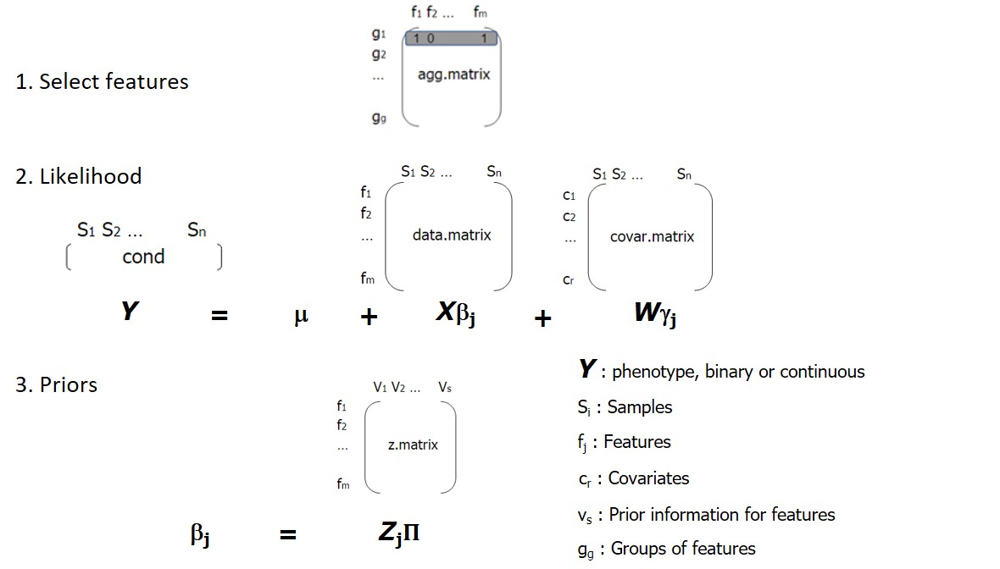

```{r setup, include=FALSE}

knitr::opts_chunk$set(echo = TRUE, message = FALSE, warning = FALSE)

```

# Introduction

**HOmics** is an R package to integrate omics data by capturing hierarchical relations between omics in their association to phenotype. 
It contains two main functions, the generic **HOmics()** function and **HOmics.meth()**, to analyze specifically methylation of genes affecting a phenotype. Details on how to apply this latter function are available in the [HOmics methylation gene integration vignette](HOmics_methylation_gene_integration.html).

# Installation

**HOmics** fits Bayesian models through the package `r CRANpkg("rjags")`, which needs the JAGS (Just Another Gibbs Sampler) environment to be installed. JAGS is a program for the analysis of Bayesian hierarchical models using Markov Chain Monte Carlo (MCMC) simulation.
You can install JAGS easily through this link: [http://mcmc-jags.sourceforge.net/](http://mcmc-jags.sourceforge.net/)
Once JAGS is installed you only need to install the **HOmics** package:

```{r HOmics}

# library(devtools)
# install_github("lnonell/HOmics")

library(HOmics)

```

HOmics depends on the following R packages:

- Biobase
- doParallel
- foreach
- minfi
- rjags
- MCMCvis
- dplyr
- purrr
- ggplot2

# The model

**HOmics** fits a Bayesian hierarchical model for each group of features specified. The steps to fit each model are the following:

1. Selects a group of features to model their association to phenotype
2. Fits the likelihood (first level in the hierarchical model) accounting for the prior information (second level of the hierarchical model). `r CRANpkg("rjags")` is used to fit the hierarchical model with the MCMC approach. These are the steps internally taken to fit the model and get the results:
   1. The model is initially fitted with three Markov chains and default initial values
   2. The model then is updated in the *burn in* phase, with 2000 iterations
   3. Coefficients (beta estimates) for all features are obtained for the posterior distribution by sampling, with 2000 iterations
   4. Function MCMCsummary of package `r CRANpkg("MCMCvis")` is used to obtain summaries

Convergence has been tested in simulated data with these parameters and the three Markov chains were considerably stable.


# Data


As previously stated, **HOmics** fits a Bayesian hierarchical model for a group of features. For that the **agg.matrix** is needed. 

Input data parameters for main function **HOmics** are the following:

- **data.matrix**: measurements of *m* features in *n* samples. Matrix with features as rows and samples as columns. It can be for instance a gene expression matrix or a matrix of CpGs beta-values.
- **agg.matrix**: aggregation matrix for features. Each row represents a group. It must contain features as columns and the aggregation criteria as rows. If a feature belongs to a group in its corresponding row and columns position should be a 1, if not a 0. A model will be fitted with the selected features in each row by selecting those with 1s. It can be for instance a matrix of genes belonging to functions or genes close to CpGs. 
- **cond**: condition, response or phenotype variable. Usually a numerical factor with two levels representing the conditions to compare although it can be a continuous vector too. If **cond** is numerical (continuous response), a hiearchical linear regression model will be fitted instead of the default hierarchical logistic regression model. Details on this parameter are to be found below.
- **z.matrix**: matrix with prior information related to features, with rownames the features and prior entities. It can be the miRNAs targeting genes specified in the data.matrix.
- **covar.matrix** (optional): vector with a covariate or matrix of continuous covariates, with samples as rownames (in the same order as cond) and covariates as columns. Default = NULL.
- **cores** (optional): cores in case of parallelization. Default = 1 (no parallelization).

Figure 1 summarizes the relationship among the different needed objects in the model hierarchy.


```{r fig1, out.width = "90%", echo = FALSE}

```


## Response variable, phenotype or condition

**cond** is the response variable and should be a vector with the same length and order as samples in **data.matrix**  (specified as columns).
Response variable can be continuous or categorical but depending on its nature it will be transformed to fit the hiearachical model.

**HOmics** will fit a hierarchical logistic regression model when the response is binary or a hierarchical linear regression model if the response is continuous.

### Categorigal responses

JAGS needs a vector of 0s and 1s, so vector **cond** will be converted if it is not such.
The rules to convert it are the following: 

- if **cond** is a factor, it will be converted to a vector of 0's and 1's. Remember when converting to factor in R, it assigns the levels in alphabetical order by default. So for instance, in the following code, for vector *a*, 2 will be taken as the level of reference. In this case, we would compare 4 vs 2. For vector *b*, **HOmics** will use "healthy" as the reference level and the comparison performed will be "tumor" vs "healthy". 
You can use function *relevel()* to select a different reference level.

- if **cond** is a character variable, it will be converted to a numerical vector by converting it first to a factor.

This is the internal code used to transform the variable:

```{r cond1}

a <- factor(c(2,4,4,2,4))
levels(a)

cond.a <- as.numeric(a)-1
cond.a

b <- c("tumor","healthy","tumor","tumor","healthy","healthy")
levels (b)

cond.b <- as.numeric(b)-1
cond.b


```


### Continuous responses

When the response variable is continuous, a hierarchical linear model will be fitted.

## Covariates

The model accepts one or more covariates in parameter **covar.matrix**. **covar.matrix** can be a vector or a matrix but in both cases the values must be in the same sample order as **cond** and as the columns of **data.matrix**.


# Parallelization

Parallelization is enabled with the use of packages `r CRANpkg("doParallel")`  and `r CRANpkg("foreach")`, which should work in any operative system. 

Parameter **cores** will enable parallelization in the functions. Use function *detectCores()* in `r CRANpkg("parallel")` to retrieve the number of cores to work.

```{r cores}

library(parallel)
detectCores()

```


# The results

The output given by **HOmics** function is an object of class **Homics**. It contains a list of results for each analysis performed on each group of features. 

For each element in the results object, a tibble, with the following columns is specified:

- mean, sd: mean and standar deviation of coefficients for all iterations in all chains (3000)
- 2.5%, 50%, 97.5%: specified percentiles for coefficients for all iterations in all chains (3000)
- Rhat: Potential scale reduction statistic (Rhat). Values near 1 suggest convergence
- n.eff: number of effective samples for each parameter. Should the higher the better

**HOmics** objects can be subsequently filtered with function **get.signif()** to get significative features or plotted with function **plot.res()**.


# Example 1: Synthetic data

Let's create some random but realistic data.

- 10 samples
- 50 features
- 8 groups of the 50 features
- the response is a factor of 0s and 1s having length 10


```{r data}

s.n <- 10
f.n <- 50
z.n <- 10
g.n <- 8

#data.matrix, features with random normal distribution
data.matrix<-matrix(data = rnorm(500,5,3),nrow=f.n)
rownames(data.matrix) <- paste0("f",1:f.n)
colnames(data.matrix) <- paste0("s",1:s.n)

#aggregation of features g a
agg.matrix <- matrix(data = sample(rep(0:1,1000),400),nrow=g.n)
rownames(agg.matrix) <- paste0("g",1:g.n)
colnames(agg.matrix) <- paste0("f",1:f.n)

#prior matrix of features  belonging to z's
z.matrix<-matrix(data = sample(rep(0:1,1000),500),nrow=f.n)
rownames(z.matrix) <- paste0("f",1:f.n)
colnames(z.matrix) <- paste0("z",1:z.n)

#response
y <- rep(c(0,1),5)
cond <- as.factor(y)

```

Let's apply the function **HOmics**, which will fit a hierarchical logistic model.
As there are 8 groups specified in the agg.matrix, HOmics will fit 8 hierarchical models and return a list with 8 elements with the results.

```{r model}

library(HOmics)

res<-HOmics(data.matrix = data.matrix,
            agg.matrix = agg.matrix,
            cond = cond,
            z.matrix =z.matrix,
            covar.matrix = NULL,
            cores = 4) 
class(res)

```

Object **res** is an object of class **HOmics**, which contains a list of results for each group of features.

```{r model_res}

res[[1]]

```

We filter the results of those features with high probability of positive betas and also of negative betas.

```{r filter_res}

res.f.pos <- get.signif(res, param = "p.pos", threshold = 0.95, as.data.frame = T)
res.f.pos

res.f.neg <- get.signif(res, param = "p.neg", threshold = 0.95, as.data.frame = T)
res.f.neg

```

We finally plot 95% probability for the first model.

```{r plot_res}

plot.res(res, element = "g1")

```


# Example 2: Synthetic data with continuous response

```{r model2}

cond.cont <- rnorm(10,1,7)

res2<-HOmics(data.matrix = data.matrix,
            agg.matrix = agg.matrix,
            cond = cond.cont,
            z.matrix = z.matrix,
            covar.matrix = NULL,
            cores = 4) 

```

# Example 3: Synthetic data with an extra categorical covariate

```{r model3}

covar<- rep(c("A","B"),5)

res3<-HOmics(data.matrix = data.matrix,
            agg.matrix = agg.matrix,
            cond = cond,
            z.matrix = z.matrix,
            covar.matrix = covar,
            cores = 4) 

```

# Example 4: Synthetic data with an extra continuous covariate

```{r model4}

covariate <- rnorm(10,3,4)

res4<-HOmics(data.matrix = data.matrix,
            agg.matrix = agg.matrix,
            cond = cond,
            z.matrix = z.matrix,
            covar.matrix = covariate,
            cores = 4) 

```


# Example 4: Synthetic data with two extra continuous covariates

```{r model5}

co.matrix <- matrix(rnorm(20,3,4),nrow=10)

res4<-HOmics(data.matrix = data.matrix,
            agg.matrix = agg.matrix,
            cond = cond,
            z.matrix = z.matrix,
            covar.matrix = co.matrix,
            cores = 4) 

```

# Example 6: Ovarian cancer gene expression and miRNA integration

For this example we will work with data from three different sources:

- ExpressionSet obtained from bicoconductor's package `r Biocpkg("curatedovarianData")` 
- Functional annotation obtained from the MSigDB (v 6.2 [http://software.broadinstitute.org/gsea/msigdb/index.jsp](http://software.broadinstitute.org/gsea/msigdb/index.jsp)) through `r CRANpkg("msigdbr")` 
- Prior information of target miRNA downloaded from TargetScan website (v 7.2  [http://www.targetscan.org/vert_72/](http://www.targetscan.org/vert_72/)) and available as a data object in **HOmics**

With all these information we will perform a functional approach by analyzing each gene set in mSigDB related to ovarian cancer. For all genes in a gene set, we will fit a hierarchical model where prior information known about genes are their predicted miRNAs.

## Data matrix

```{r eset}
# BiocManager::install("curatedOvarianData")

library(curatedOvarianData)
data(TCGA_eset)
TCGA_eset

```

Notice that TCGA_eset is an object of class *ExpressionSet*.
We will compare ovarian cancer tumor samples in stage 4 with recurrence versus healthy samples. For that, we will subset the original *ExpressionSet* with the required constraints. Once subsetted the original TCGA_eset object, we will extract the expression data (with the function *exprs()*) and the phenotype variables (with the function *pData()*).

```{r eset_sampleselection}

pheno <- pData(TCGA_eset)
table(pheno$sample_type)

TCGA_subset <- TCGA_eset[,pheno$sample_type=="healthy" | 
                           (pheno$sample_type=="tumor" & pheno$tumorstage==4 & pheno$recurrence_status=="recurrence")]

expr.m <- exprs(TCGA_subset)
dim(expr.m) 
pheno <- pData(TCGA_subset)

```

## Response vector

Let's obtain the condition vector. 

```{r eset_condition}

cond <- pheno$sample_type
cond

```

Notice that this is a character categorical vector.

## Aggregated matrix

The aggregated matrix must contain the groups that will be analyzed, in this case each functional gene set is a group and will be specified in a row. Information is obtained from the MSigDB through `r CRANpkg("msigdbr")` and then the **agg.matrix** is constructed.
To get pathways in collection *curated gene sets* (C2) with keyword *ovarian* follow these steps:

```{r msigdb}
# install.packages(msigdbr)

library(msigdbr)

c2 = msigdbr(species = "Homo sapiens", category = "C2")

c2.ov <- c2[grep("OVARIAN", c2$gs_name),]
c2.ov

```

And, by manipulating the results, we obtain the aggregated matrix.

```{r aggregated_matrix}

agg.table <- table(c2.ov$gs_name, c2.ov$human_gene_symbol)

agg.matrix <- as.matrix(as.data.frame.matrix(agg.table))

dim(agg.matrix)

table(agg.matrix)  # 0s and 1s only

```

14 gene sets where selected.

## Prior matrix

The prior matrix with miRNAs that target our set of genes is obtained from the downloaded information obtained at TargetScan.

```{r mirnas}
# install.packages("readr")

data("targets.hs.6.2", package="HOmics")

targets

```

Let's filter the targets to get only those with probability of conserved targeting (P<sub>CT</sub>) > 0.5 and generate the prior information matrix, i.e. **the z.matrix**.

```{r mirnas_filter}

targets.f <- targets %>% mutate(PCT= as.numeric(PCT)) %>% filter(PCT >0.5) 

z.table <- table(targets.f$`Gene Symbol`, targets.f$`miR Family`)

z.matrix <- as.matrix(as.data.frame.matrix(z.table))

z.matrix[z.matrix>1]<-1

table(z.matrix) # 0s and 1s only

```

To make sure that features (in this case genes) in the three matrices are the same, we do:

```{r common_genes}

common.genes <- intersect(intersect(rownames(expr.m), colnames(agg.matrix)), 
                          rownames(z.matrix))

length(common.genes) 

agg.matrix <- agg.matrix[,common.genes]

expr.m <- expr.m[common.genes,]

z.matrix <- z.matrix[common.genes,]

```

And finally, we just need to decide the number of cores and apply function **HOmics**.

```{r model6}

library(HOmics)

res6 <- HOmics(data.matrix = expr.m, 
               agg.matrix  = agg.matrix, 
               cond = cond, 
               z.matrix = z.matrix, 
               covar.matrix = NULL, 
               cores = 6)

class(res6)

length(res6)

```

Note that 6 cores were used in this case.

Let's filter the results to obtain high probabiliy results (p > 0.95).


```{r filter6}

res6.f.pos <- get.signif(res6, param = "p.pos",threshold = 0.95, as.data.frame = T)
res6.f.pos

res6.f.neg <- get.signif(res6, param = "p.neg",threshold = 0.95, as.data.frame = T)
res6.f.neg

```

And finally let's plot results for pathway *BONOME_OVARIAN_CANCER_POOR_SURVIVAL_DN*

```{r plot6}

plot.res(res6, element = "BONOME_OVARIAN_CANCER_POOR_SURVIVAL_DN")

```


# Example 7: Methylation data

HOmics contains a specific function to analyze methylation array data. Check vignette.


# Session info {.unnumbered}

```{r sessionInfo, echo=FALSE}

sessionInfo()

```