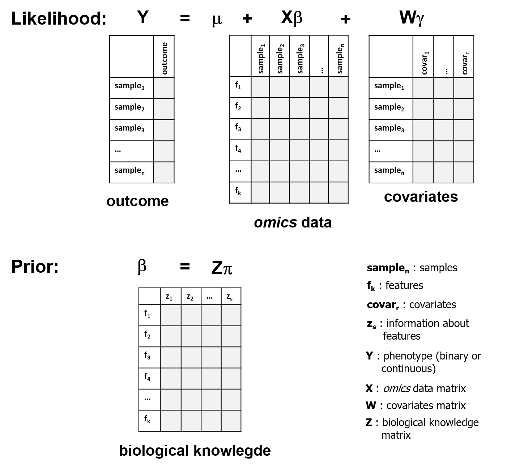
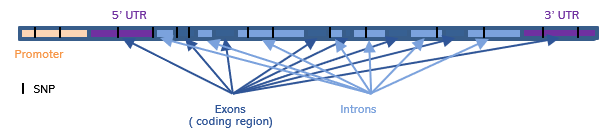

```{r style, echo = FALSE, results = 'asis'}
options(width=400)
knitr::opts_chunk$set(cache=TRUE, fig.align = TRUE, 
                      warning = FALSE,
                      message = FALSE, comment = "")
```

# Introduction

**HOmics** package is designed to analyze *omic* data by incorporating biological knowledge aiming to improve effect estimates obtained from single association analyses. Instead of assuming that every *omic* feature is a priori equally likely associated with the outcome of interest, one can quantitatively incorporate existing information about the features into the analysis. The ultimate goal of this approach is to obtain a better rank of features by combining both, the effect estimates from the data and a priori biological knowledge. Next we illustrate some examples that include SNP association studies, where information about genic annotations can be incorporated in the analyses and epigenomic studies where relative position to the closest gene is incorporated for each CpG. 

The general idea is described in the following figure




```{r load}
library(HOmics)
library(dplyr)
```


# SNP association analyses

In the GWAS conext, each SNP is associated independetly with the phenotype of interest. However, this conventional approach ignores existing information about the analyzed SNPs and assumes that they are all equally likely to impact the phenotype. Instead, one can incorporate information about the SNPs into a hierarchical model, in an attempt to improve the ranking of the P values for association. There are several ways of incorporating a priori information. For instance, one can weight each SNP association p-value by how well it tags to SNPs that have been previously associated with our phenotype of interest as described in the GWAS catalog ([https://www.ebi.ac.uk/gwas/](https://www.ebi.ac.uk/gwas/)). The genetic distance to these SNPs can also be used. Another option is to incorporate existing information about the SNPs into a second-stage design matrix Z. This information could be: conservation, functional category, gene location, tagging or even linkage. Here we illustrate how genic location depicted in this figure can be used to improve single SNP assocation analyses:




Let us illustrate how to do the analyses by using a real data set on obesity. We have genotypes for a total of 73 SNPs measured in 300 idividuals. Data can be loaded directly from the package by:


```{r load_data}
load("../data/obesity.Rdata")
```

We have two different objects, one for the genotypes and another for the phenotypic variables. Notice that the rownames of both objects perfectly match

```{r check}
snps[1:6, 1:5]
head(ob)
identical(rownames(ob), rownames(snps))
```

Now the idea is to associate each SNP with the obesity status (0: normal, 1: obese) by incorporating information abouth the gene position of each SNP as described in the previous figure. 

```{r rids}
rsids <- colnames(snps)
rsids
```

One can locate SNPs in and around genes by using some Bioconductor's packages as follows:


```{r snps}
library(GenomicRanges)
library(VariantAnnotation)
library(TxDb.Hsapiens.UCSC.hg19.knownGene)
library(SNPlocs.Hsapiens.dbSNP144.GRCh37)

txdb <- TxDb.Hsapiens.UCSC.hg19.knownGene
snps.annot <- SNPlocs.Hsapiens.dbSNP144.GRCh37

snpPos <- snpsById(snps.annot, rsids)
snps.loc <- GRanges(seqnames = seqnames(snpPos),
                    IRanges(start=start(snpPos),
                            end=end(snpPos)),
                    rs=snpPos$RefSNP_id)

seqlevelsStyle(snps.loc) <- seqlevelsStyle(txdb)
genome(snps.loc) <- genome(txdb)

loc <- locateVariants(snps.loc, txdb,  AllVariants())
loc <- merge(loc, snps.loc, all.x=TRUE)
m <- findOverlaps(snps.loc, loc)
mcols(loc)[subjectHits(m), "rs"] <-
  mcols(snps.loc)[queryHits(m), "rs"]
loc.unique <- unique(loc)
``` 

This is the information we have after being processed the previous chunk, a GRanges object:

```{r show_loc}
loc.unique[,c("LOCATION","rs")]
``` 

Then the Z matrix providing a priori biological knowledge can be created using this code. Notice that: 1) some SNPs may not be annotated; and 2) a given SNP may have 1 or more than one positions. This is addressed by aggregating Z matrix by the rownames. 
Notice that SNPs rs2908786 and rs3743772 are in two gene relative locations

```{r make_Z}
location <- droplevels(loc.unique$LOCATION)
Z <- model.matrix(~ 0 + location)
colnames(Z) <- levels(location)
rownames(Z) <- loc.unique$rs

Z <- t(sapply(by(Z,rownames(Z),colSums),identity))
dim(Z)

head(Z)

sort(apply(Z,1,sum), decreasing = TRUE)
```

Next code illustrates how to fit the hierachical model. We start by selecting from the omic matrix those features with annotated information

```{r Z}
rsids.ok <- rownames(Z)
omic.matrix <- as.matrix(t(snps[, rsids.ok]))
```


Then we create the W matrix which includes the covariates:

```{r covar}
covar.matrix <- model.matrix( ~ gender + age, data=ob)
```

Finally the model is fitted by

```{r HOmics}
mod <- HOmics(data.matrix = omic.matrix,
              cond = as.factor(ob$obese),
              z.matrix = Z,
              covar.matrix = covar.matrix)
```

The results are provided as a tibble

```{r show_mod}
mod
```
To visualize probability intervals

```{r plot_mod}
plot.res(mod)
```

We then can compare with the results obtained from single association analyses:

```{r SNPassoc}
library(SNPassoc)
dd <- cbind(snps, ob)
ii <- grep("^rs", colnames(dd))
dd.s <- setupSNP(dd, colSNPs = ii, 
                 name.genotypes = c(0,1,2))
ans <- WGassociation(obese, dd.s, model="log")
head(ans)
ans.odds <- odds(ans)

```

if we now plot SNPassoc OR confidence interval

```{r SNPassoc_plot}
library(ggplot2)

ans.odds$feature <- factor(rownames(ans.odds), levels=sort(unique(rownames(ans.odds)),decreasing = TRUE)) 
ans.odds <- ans.odds[!is.na(ans.odds$OR),]

p <- ggplot(data=ans.odds) +
 geom_segment(aes(x=lower,y=feature,xend=upper,yend=feature),
              arrow=arrow(length=unit(0.15,"cm"),
                          ends='both')) +
  geom_vline(linetype   ='dashed',  xintercept = 1) +
  xlab ("OR 95 confidence interval") + 
  theme(panel.border = element_blank(),
        axis.ticks.y = element_blank())
p

```

# Multivariate analysis

Instead of performing a univariate analysis for each feature, we can include all SNPs in a multivariate model to study the association with phenotype.
For that, the aggregation matrix must be specified. In this case we will create a 1's matrix containing just one row representing a group and 73 columns, one for each SNP.

```{r multiv_mod}

agg.matrix <- matrix(data=1,nrow=1,ncol=nrow(omic.matrix))
rownames(agg.matrix) <-"g1"
colnames(agg.matrix) <- rownames(omic.matrix)

mod.multiv <- HOmics(data.matrix = omic.matrix,
              cond = as.factor(ob$obese),
              z.matrix = Z,
              covar.matrix = covar.matrix,
              agg.matrix = agg.matrix)

```

If we want to assess more groups, it should be specified in the aggregation matrix, with groups in the rows and features in the columns.

The results are again provided as a tibble but it shows this time the coefficients for the multivariate model

```{r show_multiv_mod}
mod.multiv
```

and we plot the coefficients of the multivariate model

To visualize probability intervals

```{r plot_multiv_mod}
plot.res(mod.multiv)
```


# CpG methylation analyses using biococnductor's classes

In methylomics, CpGs are studied individually in their association to phenotype. However, there is some information that can be added to the model such as their relative position to the gene. We could here perform a similar analysis to the one displayed in previous section but **HOmics** contains a specific function, **HOmics.meth()** that takes advantage of standard Bioconductor classes. 
The function is prepared to process ExpressionSet (BioC) or GenomicRatioSet (minfi), standard classes when downloading GEO data using the GEOquery package. These objects have the following components:

- pheno data: information about the variables to analyze phenotype and covariate
- annotation data: featureData for an ExpressionSet  


The relative position of a CpG to the closest gene is in this case the prior information and it is directly extracted from the annotation data of the object.

We will in this example assess an ExpressionSet, extracted from the GEO series GSE117929. Data was previously downloaded using package `r Biocpkg("GEOquery")` and accessible as data object in **HOmics**. `r Biocpkg("Biobase")` package is needed to manipulate ExpressionSet class objects.

GSE117929 contains a methylome-wide analysis of 37 samples of peripheral blood mononuclear cells of systemic sclerosis (N=18) and normal controls (N=19).

```{r load_data_bioc}

library(Biobase)

data("GSE117929", package="HOmics")

GSE117929

table(pData(GSE117929)$"diagnosis:ch1")

```


The list of genes to model are obtained from [PMC5988798](https://www.nature.com/articles/s41598-018-26894-4), and we just call the function


```{r model}

genes <- c("CCR5","CXCR4")

res.meth <- HOmics.meth(meth.data = GSE117929,
                   pheno.cond.col = "diagnosis:ch1",
                   annot.gene.col = "UCSC_RefGene_Name",
                   annot.z.col = "UCSC_RefGene_Group",
                   annot.mult.sep = ";",
                   z.matrix = NULL,
                   pheno.covar.col = NULL,
                   gene.list = genes,
                   cores = 1)

class(res.meth)

```

Let us see the results

```{r model_res}

res.meth[[1]]

```

We filter the results of those CpGs in genes with high probability of positive coefficients (betas) and also of negative coefficients in the adjusted bayesian hierarchical model. In this example we filter at a significance level of 0.8 for demo purposes.

```{r filter_res}

res.f.pos <- get.signif(res.meth, param = "p.pos", threshold = 0.8, as.data.frame = T)
res.f.pos

res.f.neg <- get.signif(res.meth, param = "p.neg", threshold = 0.8, as.data.frame = T)
res.f.neg

```

We finally plot 95% probability for the first model.

```{r plot_res}

plot.res(res.meth)

```

We will adjust the model with sex variable, which is specified in phenoData as 'gender:ch1'

```{r sex model}

genes <- c("CCR5","CXCR4")

res.meth.sex <- HOmics.meth(meth.data = GSE117929,
                   pheno.cond.col = "diagnosis:ch1",
                   annot.gene.col = "UCSC_RefGene_Name",
                   annot.z.col = "UCSC_RefGene_Group",
                   annot.mult.sep = ";",
                   z.matrix = NULL,
                   pheno.covar.col = "gender:ch1",
                   gene.list = genes,
                   cores = 1)

class(res.meth.sex)

```

And we filter adjusted results

```{r filter_res_sex}

res.meth.f.sex.pos <- get.signif(res.meth.sex, param = "p.pos", threshold = 0.8, as.data.frame = T)
res.meth.f.sex.pos

res.meth.f.sex.neg <- get.signif(res.meth.sex, param = "p.neg", threshold = 0.8, as.data.frame = T)
res.meth.f.sex.neg

```

# Integration of *omics* data

In this example, we will use GEO public data from a data superseries (GSE77276) containing methylation data (GSE77269) but also RNA-seq expression data (GSE77509) from the same set of samples. 


# Session info {.unnumbered}

```{r sessionInfo, echo=FALSE}
sessionInfo()
```

